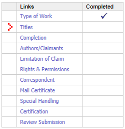

## Reasons for Registering

Do you have original music of yours lying around at home? Do you write a little copyright symbol with the year at the bottom? Whether you have that mystic symbol ⚡&copy⚡ on it or not, your work is protected. According to the [U.S. Copyright Office](https://www.copyright.gov/), your work is under copyright protection the moment it is created and fixed in a tangible form that is perceptible either directly or with the aid of a machine or device.[^1]

[^1]: [Copyright Office FAQ](https://www.copyright.gov/help/faq/faq-general.html#register)

So really, no reason to proceed with copyright...er, right?

After discussing my plan to place all of my original music online for anyone to use with a friend of mine, I came to the conclusion that I should register my works. Everyone will have their own reasons but my negative reasons are:

- I don't want someone to say they wrote my tune!
- I don't want a few bars of my tunes played on some cooking show amongst 90 other tunes.
- I don't want my tunes used for any advertising or political event.
- I don't want my tunes used for on-hold music.

My only positive reason, and I consider it the main reason to register, is I want musicians to feel free to play, arrange, or record any of my tunes without worrying about getting my okay. I just want the tunes to stay mine. Given the openness I want, I felt it was in my best interests to have the works registered.

What are some reasons **_you_** might have for copyrighting your music?

<Warning>
  Think about how you'd feel if one of your tunes showed up on the Internet with someone saying they wrote it? What if
  you heard it promoting a product you didn't like? What if a high ranking politician used it at some sort of, oh, I
  don't know, rally without your okay (or even with you explicitly telling them they most definitely did not have the
  right)? You'd want some legal backing to show that you wrote the tune, right?
</Warning>

## What am I registering?

I've got seven tunes to register. One I wrote in 1985 and the other six in 2020.

## Let's get started!

I did a quick search on "copyright" because what project doesn't start out with a quick search on the Internet? First on the list is the [U.S. Copyright Office](https://www.copyright.gov/). As you might expect, there is a wealth of information on this site. I knew I wanted to register some works so I clicked on a link for [Register Your Works](https://www.copyright.gov/registration/).

Right at the top, is a note about registering a group of unpublished works. Hey, that's me! It says you may register up to 10 of them for one price.[^2]

[^2]: 85 dollars as of 2021-02-28

First step is to Log In to the Electronic Copyright Office (eCO) Registration System by clicking on the button with that same name!

<Info>
  Have you noticed that on government websites buttons are really long? I used to work in local government and it seemed
  the norm.
</Info>

You'll need to create an account first. But, once you are logged in, you've got a multitude of menu options to look over! Amongst those is "Register a Group of Unpublished Works" which you should by all means click!

<Warning>

### Strange Message

I see an alert when I click this button, "Note: Browsers other than Mozilla Firefox may show less than optimal
performance when used with the eCO system." Well, it seems fine on Chrome and Edge. I didn't have Firefox or any other
browsers installed to try at the moment.

</Warning>

There **_is_** a video you can watch that goes through all the minutia of registering your group of unpublished works for copyright. I did end up watching bits of that as some aspects of the process were not as clear as I thought. I wanted to put "&copy Year Koamuse - All rights reserved" at the bottom of my tunes. It seems what people do instead of putting just their name. There were places in the form asking for Organization Name. When I did try to enter this, hoping it would just have it in there as well as my name, it told me I must say it is a work for hire. None of these are though. I'm still using _Koamuse_ on the sheet music like I want but there is no mention of it in the copyright registration I filled out. It is on the files I've submitted though. I hope that isn't wrong!

## Registering

After clicking the menu item, you'll get to read about Eligibility Criteria and what is required to complete the application. After you click Start Registration, the fun begins.

The site presents the process like a wizard. You "Continue >>" from one item to the next. I sadly did not document this at the time of entry but here are some things I remember that will hopefully help someone.

If you click Continue >> when you are done with each section, you should flow down the lists of links. Each row's "Completed" cell should have a check mark when you are done. If you "Save For Later" you may need to click a link to revisit one that got skipped.

There's a place to enter the year of registration. The site states you should put the most recent work's year so for me, it is 2020 for all of them.

<Success>

### 🔥 Hot Tip 🔥

Pick the song you want to be the **_main_** one first. When you are done, the title will be that one and however many Other Published Works. For me, it was _Safe and 6 Other Unpublished Works_.

</Success>

## Paying

After you've entered all the information in the registration section, you will need to pay. I was confused (and worried) that I was done and somehow forgot to submit my works. DON'T PANIC[^3], you'll get your chance to upload files soon.

[^3]: for the 42 or so of you that don't know, [The Hitchhiker's Guide to the Galaxy](https://en.wikipedia.org/wiki/The_Hitchhiker's_Guide_to_the_Galaxy)

I believe I used a credit card (you know, points!) and gave them my fee. It processed very quickly and I was able to move on to step 3.

## Uploading Files

As the site and video both remind you, make sure the names of your files match the titles of your works.

One of my works is called _Safe_ and wouldn't you know, the file was called Safe.pdf. When it was uploaded, the process changed it to lowercase, `safe.pdf`. If you have any filenames with spaces in them, they will become underscores when they are uploaded, so, `Purple Carrot.pdf` becomes `purple_carrot.pdf`.

All of my works were PDFs of lead sheets or scores done in Finale. To make it as simple as I could, I had the PDFs in a separate folder so I could easily do a select all and upload them in one bunch.

## Success?

I received a couple of emails. One telling me they happily accepted my money. The other telling me that the files I submitted were successfully uploaded.

Six days later I'm wondering, "Where's my copyrights?!" which lead me to finding a [pdf](https://www.copyright.gov/registration/docs/processing-times-faqs.pdf) that told me the current estimate for receiving my certificate, on average, is 2.2 months assuming no correspondence required. I really assume there won't any required be but you never know.

## Success!

Submitted the forms on February 22, 2021 and received an official document in the mail on June 7, 2021. So, a bit over 3 months. Not bad for 2021 I say!

##### Attributions

Photo by [Ken Feliciano (Me!)](https:koamar.com)
