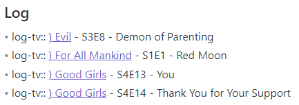
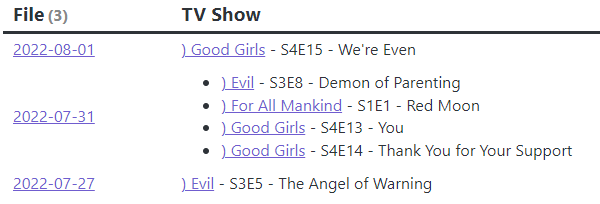
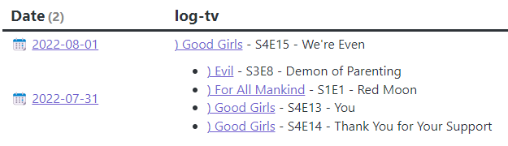
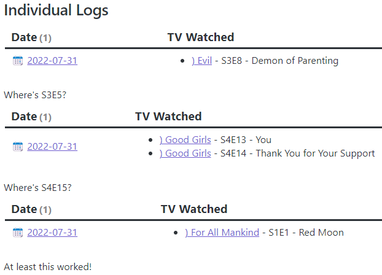
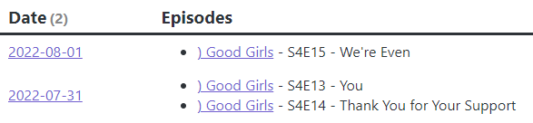
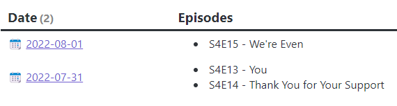

<Info>

**tl;dr**

Jump to the [Final code](#final-code)

</Info>

## Inspiration

I was watching the recordings from the [Linking Your Thinking Conference](https://www.linkingyourthinking.com/lytcon/nick-milo-keynote) and I got to [Leah Ferguson: Start and End Your Day With a Daily Note](https://www.youtube.com/watch?v=ESo0TXkFyJo). One takeaway I got from her talk was, "I too could use a low friction way of adding some logging in my vault!" I thought I would do just what she said but it quickly got out of hand.

## The requirements

For this to work, you'll need some plugins:

- [DataView](https://blacksmithgu.github.io/obsidian-dataview/)
- [Templater](https://silentvoid13.github.io/Templater/)
- [Sequence Hotkeys](https://github.com/moolmanruan/obsidian-sequence-hotkeys) (optional)

## The basic how-to

- In your daily note, you use a `DataView` field to log things, like `log-thingy::` Did the thingy!

In Leah's example, she's using `log-podcast::` amongst others. I've got that and a few others like log-music, log-play, log-tv, and log-read.

- I used Templater to create some tiny templates for each of these so I don't have to type them perfectly each time.
- I use Sequence Hotkeys so I can have one main hotkey have multiple functions
  - `Ctrl + L t` fires off the `log-tv::` template
  - `Ctrl + L m` fires off the `log-music::` template

Here's one day (out of 3) in the daily log:


Wherever you want a list of things you logged, you add a DataView query. Here's the basic idea from Leah altered for my vault. Let's do TV.

```sql
TABLE log-tv As "TV Show"
FROM "10 Journal/11 Daily"
WHERE log-tv
FLATTEN file.link
SORT file.link desc
```

This creates the following.


For each episode I watch, I make a quick note in my daily note log. Sometimes, I might just jot down a note. Sometimes, an episode, and if there is a note on the show, I'll put a link to it.

- `log-tv::` wasn't really watching but I know I was in the room for a few Guys Grocery Games
- `log-tv::` Last Week Tonight with John Oliver - Inflation
- `log-tv::` [[) Good Girls]] - S4E15 - We're Even [^1]

[^1]: I'm using codes for media recommended by Bryan Jenks in his [My 2021 Comprehensive Obsidian Zettelkasten Workflow](https://youtu.be/wB89lJs5A3s) video. The `)` indicates it is Entertainment. It's long but I think I watched the whole thing when I was getting started with Obsidian!

## Expanded use case

Now that I've started entering notes in the log, I want to see a log on the note itself! My initial idea was to add the note to the `WHERE` clause in the query.[^2]

[^2]: I also added a little emoji in there for grins.

```sql {5}
TABLE WITHOUT ID
  "📆 " + file.link AS "Date",
  log-tv
FROM "10 Journal/11 Daily"
WHERE contains(log-tv, "[[) Good Girls]]")
FLATTEN file.link
SORT file.link desc
```

Unfortunately, while this **_does_** give me only days where that show was watched, it includes all of the other log-tv entries as well.


I looked through the Dataview documentation and found the `filter()` function. That'll do it![^3]

[^3]: And since it uses an arrow function, it's cool! Luckily I know enough JavaScript to get that. Not much more mind you!

```sql {3}
TABLE WITHOUT ID
  "📆 " + file.link AS "Date",
  filter(log-tv, (x) => contains(x, "[[) Good Girls]]")) AS "TV Watched"
FROM "10 Journal/11 Daily"
WHERE contains(log-tv, "[[) Good Girls]]")
FLATTEN file.link
SORT file.link desc
```

Sure enough, that **_almost_** works!


At least now I'm starting to come up with some success criteria:

- ✅ Multiple logs for a day include all entries
- ❌ Single log for a day is included in results

A bit of `console.log()-ing` and I find that if there are multiple logs for a day, they are stored in an `array` (makes sense) but if there's a single log, it's just a `string`. The `filter()` function needs to work on arrays and the string just isn't included in the results magically.

At this point, I went off into DataView JavaScript land, sent everything into an endless loop, hard quit Obsidian, and went to bed.

## DataView JS time

The next day, feeling refreshed, I remembered seeing a way to get a dataset in Dataview using normal Dataview syntax. I thought this would be best since I'm so close. It appears I can just plug my initial query into the `dv.query()` function and get a nice result set. I removed the aliases and the filtering, thinking I'll do that in JavaScript.

```js
const data = await dv.query(`TABLE WITHOUT ID file.link, log-tv
	FROM "10 Journal/11 Daily"
	WHERE contains(log-tv, "[[) Good Girls]]")
	SORT file.link desc
	`)
```

My plan is to run through this data and create a new array wherein everything is an array so it looks consistent. My JavaScript skills are less than stellar but I sure thought I'd be doing something without `forEach()` but here it is with `forEach()`.

```js
if (data.successful) {
  let output = []
  data.value.values.forEach(function (e) {
    if (typeof e[1] === 'string') {
      output.push([e[0], Array(e[1])])
    } else {
      output.push([e[0], e[1].filter((e) => e.contains(`[[) Good Girls]]`))])
    }
  })

  dv.table(['Date', 'Episodes'], output)
}
```

Using console.log({data}) I could see there was a bit of nesting going on, hence `data.value.values` is my starting point.

- "`values` is an array of stuff" is how I'm thinking of this. There are two possibilities for each row in the array:
  - `link, string` - When `[0]` is a link and `[1]` is a string, there is only one log entry for this type (i.e. log-tv) on the day and, because of the WHERE clause in the Dataview query, it is for the current show.
    - I thought at first I could just push this `string` into the new array but it has to be converted so it is an array itself. This was so much easier than I thought it would be. Array(`string`) does the trick, at least here.
  - `link, array` - When `[1]` is not a string, it's an array of shows on that day and I want to filter that array so it only includes the current show
    - Again, because of the WHERE clause above, there's at least one record for this show for each day, `[0]`, so it's safe to push a new entry for this day.
    - Then push the current array but filter it for the current show.



There's S4E15!

- ✅ Multiple logs for a day include all entries
- ✅ Single log for a day is included in results

<Success>

**Just in time!**

It's working with JavaScript. For Good Girls, we're so close to the end of Season 4. We're going to watch the Season Finale tonight. I bet Season 5 will be very exciting. Wait, what? Cancelled? C'mon Netflix pick it up at least to give it some closure!

</Success>

## New requirements

Even when you're ~~wasting time~~ working on important projects for yourself, you run into things you know you'd like to change.

- I like the idea of having an emoji next to the date and I don't want to go through Supercharged Links to add it as I really don't want it everywhere. It seems easiest to do it in the query as I was doing that originally.
- I'm on the page, I don't need to see a link to the page!
  - I'd done this before using `.replace()`
  - Since I'm basing lots of decisions on the current show being in the data, I wait until the end to fix this up

```js {5,10-11}
if (data.successful) {
  let output = []
  data.value.values.forEach(function (e) {
    if (typeof e[1] === 'string') {
      output.push([e[0], Array(e[1].replace('[[) Good Girls]] -', ''))])
    } else {
      output.push([
        e[0],
        e[1]
          .filter((e) => e.contains(`[[) Good Girls]]`))
          .map((e) => e.replace('[[) Good Girls]] -', '')),
      ])
    }
  })

  dv.table(['Date', 'Episodes'], output)
}
```



## New problems

**Yes! Done! Ready for Season 5...er, not done...**

For my `log-music` entries I have some that are just a link to the tune. Like this!

- log-music:: [[} Stanley Clarke - Silly Putty]]

What does this mean? By default, I suppose it means I listened to the tune. On this date, for this tune, I was getting ready to transcribe it. Find a recording, see if there's already a chart on the Internet[^4], and decide whether I need to transcribe it or not.

[^4]: There was but too many pages. I only needed the keyboard part!

I went to the note in Obsidian for that tune and saw nothing! Nothing in the Weekly note showing all log-music entries either. Time for a couple more criteria for success!

- ✅ Multiple logs for a day include all entries
- ✅ Single log for a day is included in results
- ❌ A log entry that is just a link displays in results of log type (i.e. log-music)
- ❌ A log entry that is just a link displays in results for the linked page

_A few more console.log()'s later and..._

- When there is a single value, if it's a string, it needs to convert to an array.
- If it is only a link[^5], then it also needs to convert to an array. In this case, it is a `Link` object and it has a `path` property.

[^5]: I should probably never say **_only_** a link in the context of Obsidian but, there ya go!

This will fix it for my weekly view and should work anytime you want to display a list of all of a log type (i.e. log-music).

```js {4-5}
data.value.values.forEach(function (e) {
  if (typeof e[1] === 'string') {
    output.push([e[0], Array(e[1])])
  } else if (typeof e[1] === 'object' && e[1].hasOwnProperty('path')) {
    output.push([e[0], Array(e[1])])
  } else {
    output.push([e[0], e[1]])
  }
})
```

- ✅ Multiple logs for a day include all entries
- ✅ Single log for a day is included in results
- ✅ A log entry that is just a link displays in results of log type (i.e. log-music)
- ❌ A log entry that is just a link displays in results for the linked page

### The final problem

Now, I'm looking at having a log on the note page that shows I did _do something_ related to this note on a day but I wrote absolutely nothing else about it.

**Options**

- Have some sort of default text in the note. But what?
- Have nothing in the note other than a link to the daily note, rather like a back link. But we already have back links.
- Always include _something_ in a log entry. It could be quick! For music it could be **listened** or **practiced**.

Currently, I've left things so if the log is just a link, it will not display in the linked note. I think I'd rather force myself to add a word or two rather than just put a link and be done with it.

## Final code

Here are the templates I came up with for my Weekly and Individual Notes. Place these inside of `dataviewjs` code fences.

### Temporal query

- Change all occurrences of `log-tv` to whatever your log field is called.
- This is in my weekly note. You can use whatever you need for the date range. Perhaps this goes into your monthly note? Perhaps remove it to show all entries?
- Change the header, Watched, to something that makes sense for what you are logging.

```js {1,3-5,21}
const data = await dv.query(`TABLE WITHOUT ID "📆 " + file.link, log-tv
	FROM "10 Journal/11 Daily"
	WHERE log-tv
	  AND file.ctime >= date(<% tp.date.weekday("gggg-MM-DD", 1, tp.file.title, "gggg-[W]ww") %>)
	  AND file.ctime < date(<% tp.date.weekday("YYYY-MM-DD", 8, tp.file.title, "gggg-[W]ww") %>)
	SORT file.link desc
	`)

if (data.successful) {
  let output = []
  data.value.values.forEach(function (e) {
    if (typeof e[1] === 'string') {
      output.push([e[0], Array(e[1])])
    } else if (typeof e[1] === 'object' && e[1].hasOwnProperty('path')) {
      output.push([e[0], Array(e[1])])
    } else {
      output.push([e[0], e[1]])
    }
  })

  dv.table(['Date', 'Watched'], output)
}
```

### Note query

- Change all occurrences of `log-tv` to whatever your log field is called.
- Change the header, Episodes, to something that makes sense for your log field.

```js {1,3,24}
const data = await dv.query(`TABLE WITHOUT ID "📆 " + file.link, log-tv
	FROM "10 Journal/11 Daily"
	WHERE contains(log-tv, "[[<%tp.file.title%>]]")
	SORT file.link desc
	`)

if (data.successful) {
  let output = []
  data.value.values.forEach(function (e) {
    if (typeof e[1] === 'string') {
      output.push([e[0], Array(e[1].replace('[[<%tp.file.title%>]] -', ''))])
    } else if (typeof e[1] === 'object' && e[1].hasOwnProperty('path')) {
      output.push([e[0], Array(e[1])])
    } else {
      output.push([
        e[0],
        e[1]
          .filter((e) => e.contains(`[[<%tp.file.title%>]]`))
          .map((e) => e.replace('[[<%tp.file.title%>]] -', '')),
      ])
    }
  })

  dv.table(['Date', 'Episodes'], output)
}
```

Have fun!

##### Attributions

Photo by [Photographer (@photolli)](https://unsplash.com/@photolli?utm_source=unsplash&utm_medium=referral&utm_content=creditCopyText) on [Unsplash](https://unsplash.com/s/photos/obsidian-and-log?utm_source=unsplash&utm_medium=referral&utm_content=creditCopyText)
