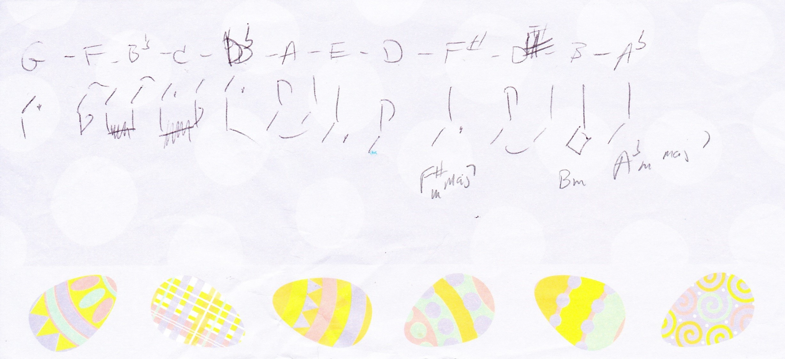
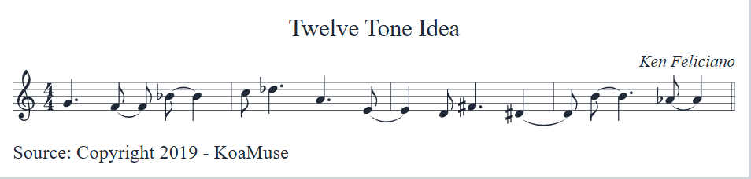

## The Story

It's spring 2019. We're out visiting friends and relatives with abandon. We're not wearing masks for any pandemic related reason—yet. And that's all I'm going to say on that! I know it's Easter because I wrote the idea for this piece while at my mom's house and, look at the paper! We were in a lull and some strange notes entered my head. I grabbed a piece of Easter egg note paper and wrote them down with a sketchy rhythmic idea as a twelve tone melody.

I think my original thought was to work on a twelve-tone piece but I digressed early when I wrote a few jazz chords on the paper. And that was it for 2019!

Here's the original thought of melody and rhythm I had. I'm sort of guessing and it's not that important. Mainly I wanted to use `abc` in `markdown`!

## Development

Now in spring 2020, not so much visiting, more wandering about the house and our neighborhood. I ran into the scrap of paper lying on the piano. I decide these are good bass notes. Let's put some chords on them! I'm sure the final version isn't the chords I had originally so I won't bother trying to figure out what they could be beyond those scratchings from 2019.

I thought of a little melody that might sound nice over the chords. First I had to get over that it sounded like _Some Other Time_ as played by Bill Evans. The melody is done and apart from a chord or two I'm not bonding with, the piece is done. But I let it sit a bit.

<Info>

**Some Other Time by Leonard Bernstein**

I didn't know Leonard Bernstein wrote this. It's from the 1944 musical _On the Town_. I thought since it had so many qualities of Bill Evan's _Peace Piece_ that he must have written this too. I really should research the music I play more. Let's just say it is a lovely piece of music!

</Info>

## Final Refinement

Still sheltering in place. We're eating a meal at the table (not the couch, the real table in the dining room). I see this piece sitting mostly done at the piano and notice that melodically, all the rhythms are fairly consistent, except the first phrase. I hop over to the piano and tweak that to match, finalize the chords, and it is done!

## Your turn!

Here's the lead sheet with versions for E&#9837; and B&#9837; instruments. If you try it out and like it, feel free to perform and/or record it. If that happens, I'd love to see/hear the performance but no pressure! I doubt it's a hit song, but if it is, and you make money, enjoy the money! There are days when I absolutely love it and there are other days where I run into a chord while soloing and wonder why I chose that one! I've yet to play it with a group but I do look forward to that. Maybe someday there will be a recording here to listen to.

  <a href='/charts/twelve-chord-tune-c.pdf' download='twelve-chord-tune-c.pdf'>
    Download PDF - C version
  </a>

  <a href='/charts/twelve-chord-tune-eflat.pdf' download='twelve-chord-tune-eflat.pdf'>
    Download PDF - E&#9837; version
  </a>

  <a href='/charts/twelve-chord-tune-bflat.pdf' download='twelve-chord-tune-bflat.pdf'>
    Download PDF - B&#9837; version
  </a>

## Update 2025-04

Replaced `abc` block with image. It will no longer display negatively in dark mode. Shield your eyes!

##### Attributions

Photo of 12 Apostles in Australia by [Trevor Kay (@jedgpz)](https://unsplash.com/@jedgpz?utm_source=unsplash&utm_medium=referral&utm_content=creditCopyText) on [Unsplash](https://unsplash.com/s/photos/12-apostles?utm_source=unsplash&utm_medium=referral&utm_content=creditCopyText)
