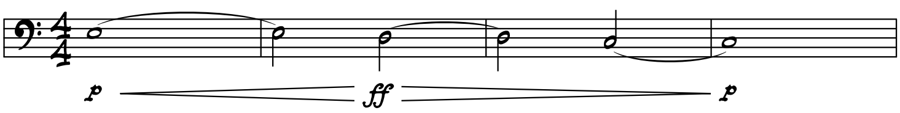
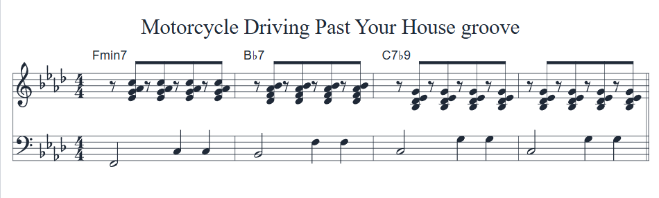

Almost two years ago on Oct 20, 2020, a motorcycle drove past my house. It was loud and I heard it through the closed windows. It sounded like this. Seriously!

It was quite loud and normally, I would have been a bit aggravated by this. Living next to a somewhat busy street (even though it is a 25 MPH residential school zone), the cars normally sound like the waves in the ocean as they drive by. But once in a while, they do **not**! This day, my mind was feeling more creative and less aggravated. Perhaps the muse was driving the motorcycle? I decided, this would make a nice peaceful Latin tune.

Originally, the motorcycle was in the key of A*min*. Okay, it could have been C but it felt minor to me! To make it a bit of a nicer key for for my alto sax playing wife, I put it into F*min*. It's still not a great key but that's where I left it. It still has the gravitas of the motorcycle.

I'm no Latin jazz expert but I consulted one. Based on how I thought it should be played, it is a _Cha_. I asked, "_Cha-Cha_?" and he said, "Well, sure, but it's a Cha." This is the groove for the rhythm player (piano or guitar) and bass.

Here are some charts. See if it sounds like a motorcycle driving past **_your_** house!

  <a
    href='/charts/motorcycle-driving-past-your-house-c.pdf'
    download='motorcycle-driving-past-your-house-c.pdf'
  >
    Download PDF - C version
  </a>

  <a
    href='/charts/motorcycle-driving-past-your-house-bflat.pdf'
    download='motorcycle-driving-past-your-house-bflat.pdf'
  >
    Download PDF - B&#9837; version
  </a>

  <a
    href='/charts/motorcycle-driving-past-your-house-eflat.pdf'
    download='motorcycle-driving-past-your-house-eflat.pdf'
  >
    Download PDF - E&#9837; version
  </a>

## Issues

My oh so glorious attempt at rendering music using `abc` in React as in [Music Notation Test](../../blog/music-test) doesn't seem to work when there are multiple `abc` blocks. They continually overwrite the first block. Hence, the screen shot in Finale for the source material example and `abc` for the groove example.

## Update 2025-04

Replaced `abc` block with image. No more dark mode support!

##### Attributions

Photo by [Harley Davidson (@harleydavidson)](https://unsplash.com/@harleydavidson?utm_source=unsplash&utm_medium=referral&utm_content=creditCopyText) on [Unsplash](https://unsplash.com/s/photos/motorcycle?utm_source=unsplash&utm_medium=referral&utm_content=creditCopyText)
