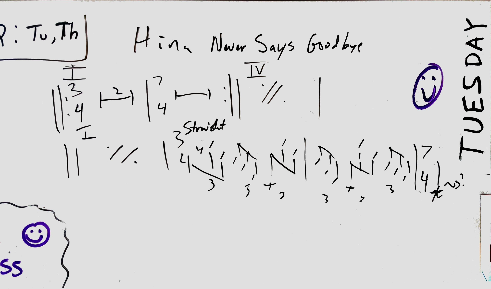

I am currently retired but I once, like many of you worked for a living. This song was inspired by my work and my good friends there. Good times when it was good I tell ya!

## Years ago

Before the pandemic but after the powers that be **_tried and failed_** to take away my pension, I was working. It's early in the morning and I'm there working. I live, er, work in cubicle four of five, once you get into our office. I'm near the refrigerator. Everyday, Hina walks by, says, "Hi!" grabs some milk for her tea from the refrigerator, and heads to her cubicle. She's **_right_** by the door to our office. We're the only ones there at this point. Hopefully, the lights are off and it is dark and peaceful.

Both of us are in a flow working on our respective projects and our co-worker arrives with a jolly 🎵Hina🎵 in a melodic singing style. He sits next to Hina and he goes about his day. Over the years, the greeting becomes a little motif for Hina. One of many unique things that made no sense outside of our workspace.

Towards the end of the day, Hina would decide she'd had enough and being next to the door, would grab her stuff and head out. If she didn't make a sound, no one knew she'd left. She always said hello she never said goodbye! This went on for sometime before I mentioned her lack of goodbyes. We just laughed about it. From that point on, we were the formal co-worker friends and always said both hello and goodbye consistently, always in a good mood. But by that time, the damage was done. There was a melody, a sketch on my whiteboard, and there were words!

Hina...never says goodbye

Everyone likes different music but Hina liked a few things I liked. She listened a lot to Dave Brubeck's Time Out album. Other times, I'd catch her listening to Bollywood, or _what I hoped_ was classical Indian music.

So, it came out as a jazz waltz-ish blues. I think of it as 6 + 7. I couldn't find a taal in 13 that matched this so I won't even try to connect with that. I did think it sounded a bit like [Three To Get Ready](https://www.youtube.com/watch?v=xmaC4WwspS4), at least in the concept of it's a waltz...wait, no it isn't!

I threw in a little tihai at the end for grins. Of course that's the toughest part to play! I thought for a real ending I'd triple the triplets but I'm not sure my fingers could move that fast!

## Your turn

Here are some charts. Play it if you dare **_(evil laughter)_** (sorry, Halloween time)! If you want to sing along, it's pretty much Hina...never says goodbye over and over until the tihai. Then it's "Never says goodbye, she never says goodbye, she never says goodbye". For bars 17-18, there are no words. It's not really a song to sing.

  <a
    href='/charts/hina-never-says-goodbye-c.pdf'
    download='hina-never-says-goodbye-c.pdf'
  >
    Download PDF - C version
  </a>

  <a
    href='/charts/hina-never-says-goodbye-bflat.pdf'
    download='hina-never-says-goodbye-bflat.pdf'
  >
    Download PDF - B&#9837; version
  </a>

  <a
    href='/charts/hina-never-says-goodbye-eflat.pdf'
    download='hina-never-says-goodbye-eflat.pdf'
  >
    Download PDF - E&#9837; version
  </a>

##### Attributions

Photo by [Vladislav Klapin (@lemonvlad)](https://unsplash.com/@lemonvlad?utm_source=unsplash&utm_medium=referral&utm_content=creditCopyText) on [Unsplash](https://unsplash.com/s/photos/hello?utm_source=unsplash&utm_medium=referral&utm_content=creditCopyText)
