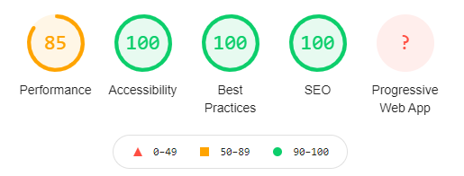

> The best day to start your website is 24 years ago. The second best day is today!

I've become interested with React, Gatsby, and Tailwind CSS. That's what I'm going to use for this site.

## Gatsby Initialization

I'm not a chef, but I love recipes. I'm a fan of not having to figure something out more than once (or twice). I've got a recipe for creating a Gatsby Site and that's what I used to start off.

For this recipe, [project-name] is `koamar.com`

I figure if you like your prettier settings more than Gatsby's, you've got a file somewhere that you'll use instead of Gatsby's.

```bash
gatsby new [project-name]
cd [project-name]

# This creates a barebone Gatsby project
# It does have a layout component and SEO

cp ~/[path-to-my-template-files]/.prettierrc.json .prettierrc
npm run format

git commit -m "Run prettier on initial Gatsby starter"

# Copy license and create README.md (if this is not just goofing around)
cp ~/[path-to-my-template-files]/LICENSE .
npx common-readme -r [project-name] -l MIT > README.md
```

## README and LICENSE files

I used [common-readme](https://github.com/noffle/common-readme) to create a starter point for `README.md`. It is geared towards creating npm packages but I find it better than a blank page!

I also stole some licensing ideas from [Dan Abramov's overreacted.io blog repo](https://github.com/gaearon/overreacted.io)! I liked how he had specific LICENSE files for code snippets and for posts. I've added another for music I plan on adding to the site.

## GitHub

On GitHub, created a new repo, connected to it, and pushed my first real commit!

```bash
# Add LICENSE-code-snippets, LICENSE-posts, and LICENSE-music
# Create initial README content
git commit -m "Add LICENSE and README files"

# Create new GitHub repo koamar.com
git remote add origin git@github.com:kenfeliciano/koamar.com.git
git branch -M main
git push -u origin main
```

### GitHub settings

This is my first **_real_** repo so I thought it best to explore GitHub more thoroughly than I have in the past. Under `Security & analysis` I enabled Dependabot alerts and Dependabot security updates.

I set up some `Secrets` so I could setup a Continuous Deployment (CD) to my hosted site location.

- FTP_USERNAME
- FTP_PASSWORD
- FTP_SERVER

## Some tidying

The default `package.json` needed updating. I wonder, "How many websites have the default Gatsby information still there?"

```JSON:title=package.json  (excerpt)
{
  "name": "koamar.com",
  "private": true,
  "description": "KoaMar website and blog",
  "version": "0.1.0",
  "author": "Ken Feliciano <kafeliciano@gmail.com>",

  /// ...lots of other stuff

  "repository": {
    "type": "git",
    "url": "https://github.com/kenfeliciano/koamar.com"
  },
  "bugs": {
    "url": "https://github.com/kenfeliciano/koamar.com/issues"
  }
}
```

The `gatsby-config.js` file also had a bit of boilerplate to customize in siteMetadata.

```js:title=gatsby-config.js  (excerpt)
module.exports = {
  siteMetadata: {
    title: `KoaMar`,
    description: `KoaMar Site and Blog`,
    author: `@koamar`,
  },
  /// ...rest of file
```

The starter included a few pages that I do not need so deleted them.

- page-2.js
- using-typescript.tsx (_it's not in me to learn TypeScript...yet_)
- gatsby-astronaut.png (👋)

Since this was going to soon replace my current website, I added a bit of ugliness to match the current site. No styling, no React, no Gatsby beyond generating the site, and no **_real_** content.

## CI/CD

I wanted Continuous Integration/Continuous Deployment (CI/CD) baked in from the start. I had previously figured out how to do this with GitHub actions. For those that are interested in getting something like this working to a generic web hosting company, feel free to look at the `main.yml` configuration.

I used the `isthatcentered/dist-to-ftp` GitHub action to send the end result to my site.

### First times a ~~charm~~ fail

The first time I ran the CI action, it failed. The initial `package.json` contained a test script with a positive message to "Write tests!" but I wasn't ready for that. I removed it **_for now_**. So it wasn't a total failure, I grabbed the happy little `badge.svg` and embedded that into my README!

## Retrospective

✅ Initial Setup

✅ Lighthouse - go Gatsby!



✅ CI/CD up and running

✅ Site migration - migrating nothing is **_so much_** easier than normal data migration projects! Old site linked to Google, new site linked to Google. 🎉

⬜ Needs a favicon - new issue

⬜ PWA - new issue

⬜ Refactor React imports - new issue

##### Attributions

Photo by [Danielle MacInnes (@dsmacinnes)](https://unsplash.com/@dsmacinnes?utm_source=unsplash&utm_medium=referral&utm_content=creditCopyText)
on [Unsplash](https://unsplash.com/s/photos/site-design?utm_source=unsplash&utm_medium=referral&utm_content=creditCopyText)
