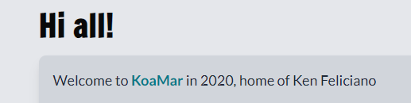
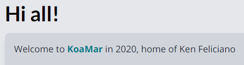

<Warning>


This implementation happened in Gatsby 2 days. At the moment, the site is still in Gatsby 2. It is also using the original gatsby-plugin-google-fonts method and not the Google Fonts v2 API.

</Warning>


## Configuring Google Fonts

Install the Gatsby plugin for Google Fonts

```bash
npm install gatsby-plugin-google-fonts
```

Configure the plugin

```js:title=gatsby-config.js
module.exports = {
  plugins: [
    {
      resolve: `gatsby-plugin-google-fonts`,
      options: {
        fonts: [
          `limelight`, // specify a font
          `source sans pro\:300,400,400i,700`, // specify font weights and styles
        ],
        display: 'swap', // uses other fonts while Google Fonts load. Recommended.
      },
    },
  ],
}
```

## Initial Ideas

My original ideas, based on just seeing what others were using and looking at a few fonts were:

- Body/Main: Lato
- Headers: Francois One
- Mono Font: Fira Code (I do like the ligatures!)

Choices for mono were: Roboto Mono, Fira Code, Fira Mono
Choices for header were: Karl, Francois One, or Neuton

### Trying them out

Francois One has only one style it looks bold. So, really only for headers without a choice of being different. Should be fine.

For Lato, which weights would I require? lato\:400,400i,600,600i,700,700i

- Regular (400)
- Regular Italic (400i)
- Semi-bold (600)
- Semi-bold Italic (600i)
- Bold (700)
- Bold Italic (700i)

<Info>


### First Time?

This is the first time I ever saw these weights for fonts. Hence, I wrote them all out so I would remember them. I came across them later, and yes, I did remember them!

</Info>


I don't like Francois One for the header. It has a something-something look. More so, I don't think Lato does it for me as a body text. Look at the "F" in Feliciano!



Trying Lato for Headers and Open Sans for body. This looks like a standard pairing in Google Fonts world for Lato. It looks much cleaner. Lato is good as a header. It matches the logo. Open Sans seems much more readable. Haven't tried code yet but hopefully Fira Code will look great with ligatures.



## Final Decision

- Body/Main: Open Sans
- Headers: Lato
- Mono Font: Fira Code

<Warning>


### One final warning

Yes, I like ligatures. I hear, and even get, the argument for not using them but I think they just look nice and I feel happy seeing them.

</Warning>


##### Attributions

Photo by [Alexander Andrews (@alex_andrews)](https://unsplash.com/@alex_andrews?utm_source=unsplash&utm_medium=referral&utm_content=creditCopyText)
on [Unsplash](https://unsplash.com/s/photos/fonts?utm_source=unsplash&utm_medium=referral&utm_content=creditCopyText)
