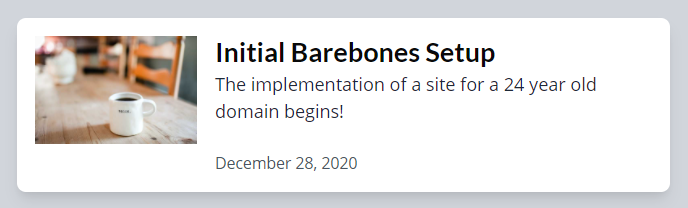
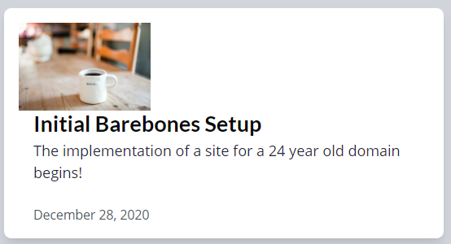
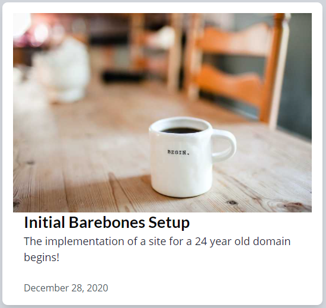
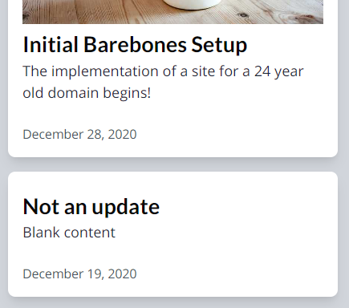
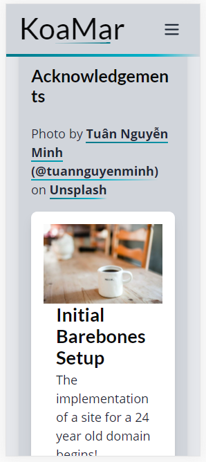
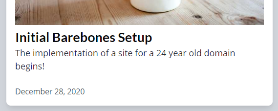

## Data Passed

From the post-list page, there is the `posts` array which is data.allMdx.edges
It is currently mapping each post over a div.
The new component should take in the `post` object and create the lovely thing.

### Extract Div to PostCard

Instead of mapping over a bunch of HTML, extract out the div with all its children to a new component. That component needs a few things!

- Img - no longer required in post-list template
- Link - no longer required in post-list template
- It also needs collection to be passed

**Easy peasy!**

## Mobile Design

_Current Design - Large Device_

_Current Design - Mobile_ with picture on the top

### Picture Adjustments

Picture needs to be larger at this point. It should fill the entire top of the card (with padding is probably alright).

Instead of `flex-row`, which is fine for desktop, change to `flex-col` and use `sm:flex-row` for desktop sizes.

The image will now be `w-auto h-auto` and `sm:w-36 sm:h-24`. So it fills the card nicely on mobile and still looks good on desktop.

Doing this for the placeholder does not go so well when it is not an image. However, it's not atrocious just having a card with no image for a mobile. Chances are, this will not happen.

That may be a big large for a phone, although it does look okay when using responsive tools in Chrome.

### Typography Adjustment

Most a pity, the other text like heading and such looks too large on a phone.

Granted this is a Galaxy Fold. All the other phone options look alright. But…

Options are to lower the font size (probably need to do that) and perhaps remove or lessen the margin around the container.

### Text Information

Now that the second flex part is below the picture, the bit of left margin is not required anymore. Just changing it to `sm:ml-4` is enough.

The text is too close to the picture now so it'll need a bit of top margin, only for mobile. Updating that to `mt-2 sm:mt-0`.

## Make Whole Card Clickable

Wrapping the entire thing in a Link works, but you can no longer select text.

## Retrospective

❌ Keep post card clickable but allow text selection and assure accessibility - created issue for this

##### Attributions

Photo by [Becky Phan (@beckyphan)](https://unsplash.com/@beckyphan?utm_source=unsplash&utm_medium=referral&utm_content=creditCopyText)
on [Unsplash](https://unsplash.com/s/photos/postcard?utm_source=unsplash&utm_medium=referral&utm_content=creditCopyText)
