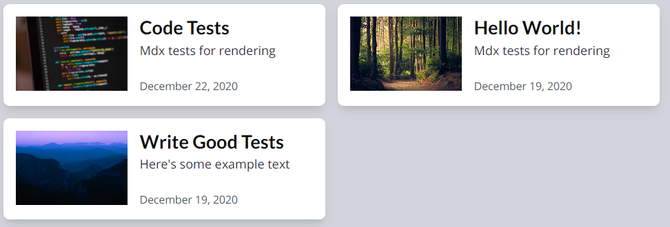

## Initial Thoughts

I'm used to using Flexbox for everything. So, that is the road I went down. I could not seem to get what I wanted, which is this, using Tailwind CSS!


Using Flexbox made it flexible but I wanted them equal too. I thought, well flex-basis would do the trick, but I didn't see that in Tailwind. It sure looked like a grid though, so, switched to using grid!

## Implementation

Created a very small styled component PostContainer to wrap up the posts.map() portion of the page.

```jsx:title=post-list.js
import tw, { styled } from 'twin.macro'

const PostContainer = styled.div(
  tw`
    lg:grid lg:grid-cols-2 lg:gap-x-4 lg:gap-y-2 lg:pb-4
  `
)

<PostContainer>
  {posts.map((post) => (
    <PostCard post={post} collection={collection} />
  ))}
</PostContainer>
```

Something tells me I'll want to extract this PostContainer to a component. I imagine using it for featured items on the main page. [Note from the future: I haven't yet!]

### Issues with Grid

On the Site Dev page, there were two posts. One had a decently sized excerpt, one was basically nothing. They did not match size.

I fixed this by using `h-full` on the PostCard.

This caused the rows to smash into each other and there was no breathing space after the posts. I added `lg:gap-y-2 lg:pb-4` on the PostContainer to fix this.

##### Attributions

Photo by [Hisham Zayadnh (@hisham_zayadnh)](https://unsplash.com/@hisham_zayadnh?utm_source=unsplash&utm_medium=referral&utm_content=creditCopyText) on [Unsplash](https://unsplash.com/s/photos/columns?utm_source=unsplash&utm_medium=referral&utm_content=creditCopyText)
