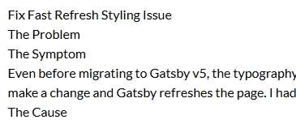
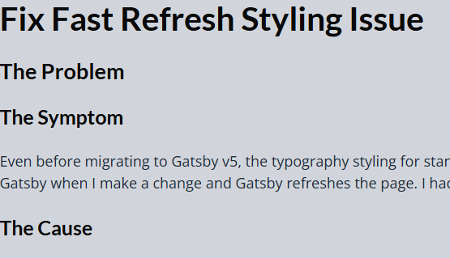

## The Problem

### The Symptom

Even before migrating to Gatsby v5, the typography styling for standard HTML elements would go away when Gatsby when I make a change and Gatsby refreshes the page. I had to refresh the page manually to see it correctly.

The problem looks like this...


... when the page should look like this!


### The Cause

When Gatsby does a Fast Refresh, it re-inserts styled-components and Tailwind stylesheets into `<head>` but as the order is not guaranteed, it breaks the formatting.

- On an initial load or hard refresh, Tailwind's stylesheet appears before styled-components.
- On a fast refresh, styled-components is inserted before Tailwind.

## The Fix

I searched for a fix on this and came up empty. So, I asked AI again. Now, it's all "we" this and "we" that.

Initially, we thought we'd add a custom `html.js` to take the place of the one Gatsby creates. This would allow us to force styled-components to insert after Tailwind even on a Fast Refresh.

```jsx:title=src/html.js {14}
import * as React from 'react'
import PropTypes from 'prop-types'
export default function HTML(props) {
  return (
    <html {...props.htmlAttributes}>
      <head>
        <meta charSet='utf-8' />
        <meta httpEquiv='x-ua-compatible' content='ie=edge' />
        <meta
          name='viewport'
          content='width=device-width, initial-scale=1, shrink-to-fit=no'
        />
        {props.headComponents}
        <div id='sc-target'></div>
      </head>
      <body {...props.bodyAttributes}>
        <div id='sc-target'></div>
        {props.preBodyComponents}
        <div
          key={`body`}
          id='___gatsby'
          dangerouslySetInnerHTML={{ __html: props.body }}
        />
        {props.postBodyComponents}
      </body>
    </html>
  )
}
HTML.propTypes = {
  htmlAttributes: PropTypes.object,
  headComponents: PropTypes.array,
  bodyAttributes: PropTypes.object,
  preBodyComponents: PropTypes.array,
  body: PropTypes.string,
  postBodyComponents: PropTypes.array,
}
```

We moved the `onRenderBody` from `gatsby-wrapper` to `gatsby-ssr`. We're also using the MagicScriptTag from `gatsby-wrapper` but still leaving it there. Okay...

```jsx:title=initial gatsby-ssr.js
import * as React from 'react'
import { StyleSheetManager } from 'styled-components'
import { wrapRootElement as wrap, MagicScriptTag } from './gatsby-wrapper'

export const wrapRootElement = wrap

export const onRenderBody = ({ setHeadComponents }) => {
  // MagicScriptTag MUST run before hydration
  setHeadComponents([<MagicScriptTag key='magic-script' />])
}
```

In `gatsby-browser` we're adding `StyleSheetManager` from styled-components. I'd never heard of this. I always think my use-cases or too simple for things like this I suppose. Early tutorials and documentation never touch on these things. We're using the div created in `gatsby-ssr` as the target for styled-components' stylesheet.

```jsx:title=gatsby-browser.js
import * as React from 'react'
import { StyleSheetManager } from 'styled-components'
import { wrapRootElement as wrap } from './gatsby-wrapper'

import './src/styles/global.css'
import './src/styles/code-layout.css'

export const wrapRootElement = ({ element }) => {
  if (typeof document !== 'undefined') {
    const target = document.getElementById('sc-target')
    return <StyleSheetManager target={target}>{wrap({ element })}</StyleSheetManager>
  }
  return wrap({ element })
}
```

It all works! But this `html.js` smells funny to me. It looks just like the `default-html.js` created by Gatsby except we've added a div into the head. When I look at the Elements console, I see this new dev is in the body! Well, yeah, of course! I do a bit more exploring on my own and decide it's better to use Gatsby's API to do this. I bring in `setPreBodyComponents` to create the div and everything keeps working.

```jsx:title=final gatsby-ssr.js {6,10}
import * as React from 'react'
import { wrapRootElement as wrap, MagicScriptTag } from './gatsby-wrapper'

export const wrapRootElement = wrap

export const onRenderBody = ({ setHeadComponents, setPreBodyComponents }) => {
  // MagicScriptTag MUST run before hydration
  setHeadComponents([<MagicScriptTag key='magic-script' />])

  setPreBodyComponents([<div id='sc-target' key='sc-target'></div>])
}
```

### Overzealousness

I started trimming out all of the stuff I didn't need and ended up removing `wrapRootElement` from `gatsby-ssr`. It didn't look like it was used, but of course it was...somehow. To me, this is magical. I mean, it doesn't seem to do anything! But, if it is not there, the site works in development but fails when you build it.

I did notice that I still had StyleSheetManager inside of `gatsby-ssr` as I was writing this. Just in case I was still being overzealous, I checked if it would build when getting rid of this. It did! This is definitely not being used in `gatsby-ssr`!

## Happy?

I am happy! Seeing your site go all funky when you fix a typo was causing friction. It made it less probable that I would spend time on this site. Now I have one less excuse!

##### Attributions

Photo by [Ken Feliciano (Me!)](https:koamar.com)
